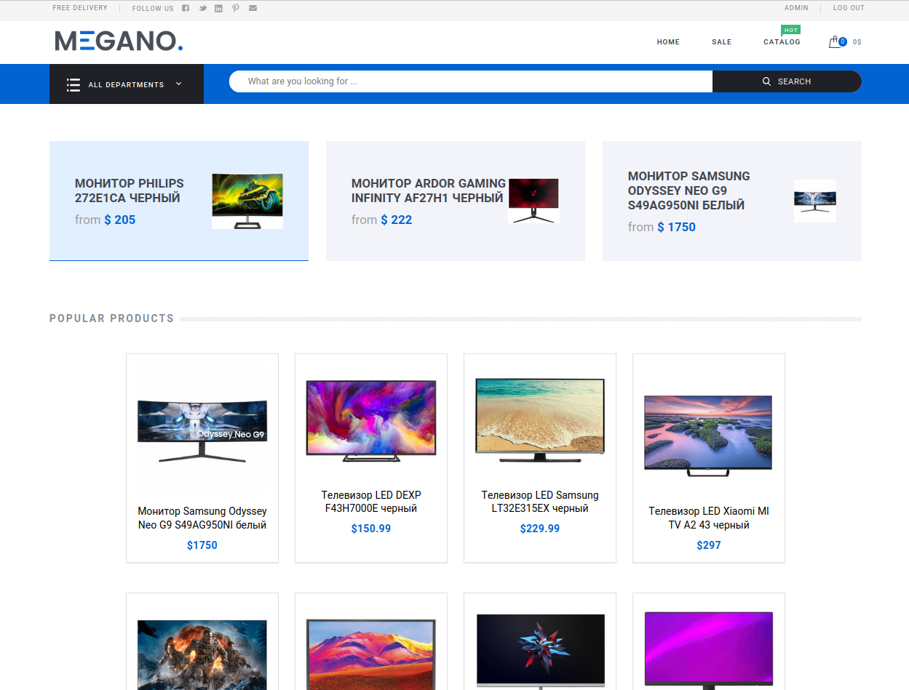
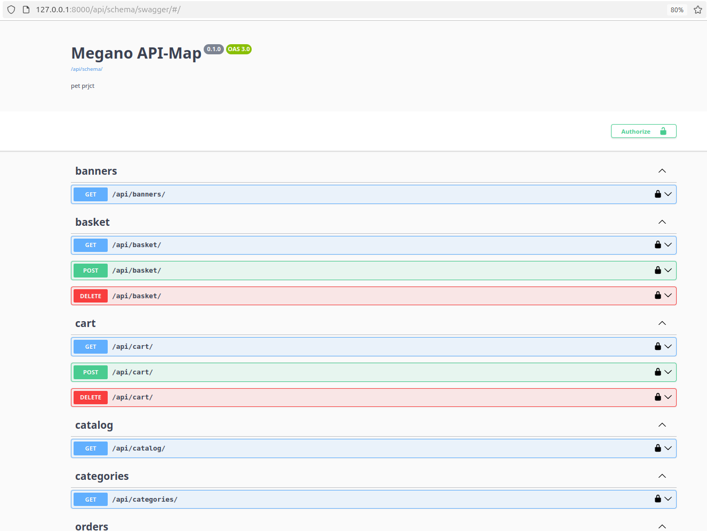

# Интернет магазин Megano (Pet-project)

Интернет магазин разработанный на Django Rest

## 🛠 Стэк

**Backend:** Python 3, Django 4, DRF

**Frontend:** JS, CSS, HTML

**Linterst:** Black, Mypy

**DB:** Django ORM, Sqlite

## Запуск проекта

Необходимо склонировать репозиторий на локальное устройство

```bash
  git clone https://github.com/MikaTarro/Megano_v1.git
```

Перейти в репозиторий с проектом куда вы склонировали репозиторий

## Установка и запуск проекта

1. Клонировать репозиторий, создать и войти в виртуальное окружение

```bash
   `pip install -r requirements.txt` - установка зависимостей
```

3. Установка frontend:

```bash
    `cd diploma-frontend && python setup.py sdist` - создание архива с библиотекой фронтенда
```

```bash
   `pip install ./dist/diploma-frontend-0.6.tar.gz` - установка фронтенда
```

4. Создание бд и загрузка фикстур:

```bash
   `cd ../megano && python manage.py make migrations` - создание миграций
```

```bash
   `pip install ./dist/diploma-frontend-0.6.tar.gz` - установка фронтенда
```

4. Создание бд и загрузка фикстур:

```bash
   `cd ../megano && python manage.py make migrations` - создание миграций
```

```bash
  `python manage.py migrate` - миграция 
```

```bash
   `python manage.py loaddata ./fixtures/* ` - установка фикстур
```

5. Запуск сервера

```bash
   `python manage.py runserver`
```

## API

Для просмотра полной документации API приложения необходимо перейти по пути

```bash
cd your-ptoject/diploma-frontend/swagger
```

и скопировать содержимое swagger.yaml и вставить его в https://editor.swagger.io/

## API drf_spectacular 

Для просмотра полной документации API приложения необходимо перейти по пути

```bash
  http://127.0.0.1:8000/api/schema/swagger/
```


## Приложения которые бb|ли реализованны в проекте:

- accounts - приложение по работе с профилем (изменение, вход, выход, регистрация и т.д)
- cart - приложение корзины (удаление товара из корзины, добавление товара в корзину и т.д)
- order - приложение по работе с заказами (создание заказа, просмотр заказа и т.д)
- product - приложение по работе с товарами (создать продукт, удалить продукт, оставить коммент к продукту и т.д)
- shop - приложение по работе с основной страницей магазина (фильтрация по категориям, цене. Пагинация страниц и т.д)

### БД

В фикстурах созданы товары и заказы, а так же суперпользователь(админ) и обычный:

# **superuser:**

Логин: admin

Пароль: admin

# **user:**

Логин: Customer

Пароль: Privet123

## Автор

- [@MikaTarro](https://github.com/MikaTarro)
